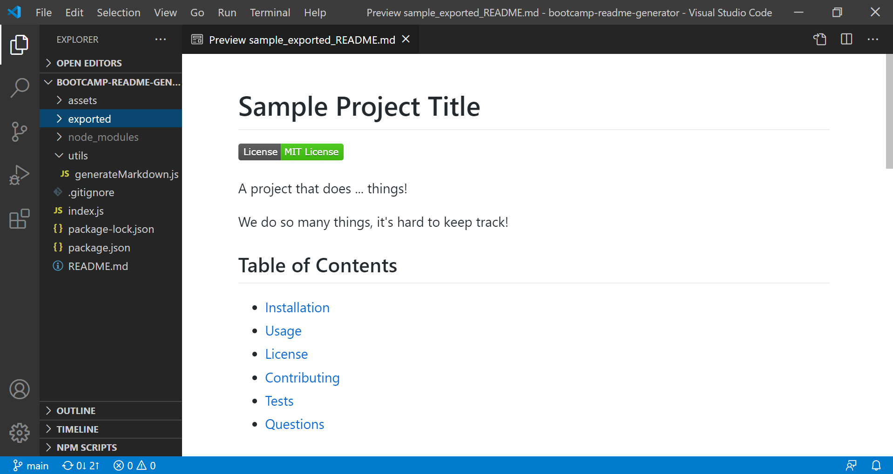

# Bootcamp - Homework 7: README Generator

A command line application that generates README files.

When run, a series of prompts are shown. The answers to these prompts are placed in a generated README file.

A user story, acceptance criteria and starter code was given for this assignment. The starter code contained empty function declarations representing the general structure of the program and an empty variable for questions.

## Purpose
According to the user story, this application is meant for developers seeking to quickly generate professional README files.

## Installation
This application uses [Inquirer](https://www.npmjs.com/package/inquirer). Be sure to run `npm install` before using it.

## Usage

:link: [View demo](https://drive.google.com/file/d/1VmOeeLeDQnkCXOmObIWv21uxn8hm3NeG/view?usp=sharing)

To run the application, run `node index`.

Then, answer the prompts. Newline characters are supported, but certain prompts may not permit you to use them (ex. writing a newline character in the name of the project).

You can find the exported README file in [`exported/`](./exported/) named: `exported_README.md`.

### :warning: Additional Notes on Usage
- If there is an existing `exported_README.md` file in `exported/`, generating a new README file will overwrite the existing one. Be sure to remove your generated README if you don't want it to be overwritten.

- Any unanswered prompts will result in an empty section of the README file, which can be edited later; however, it is advisable to fill out most of the prompts for a solid README file.

## See a sample
If you're curious as to how the generated README file will turn out, see [`sample_exported_README.md`](./exported/sample_exported_README.md).

## Built with
- [Node.js](https://nodejs.org/en/)
- [Inquirer](https://www.npmjs.com/package/inquirer)

This homework assignment is part of the [Carleton University Coding Bootcamp](https://bootcamp.carleton.ca/).
